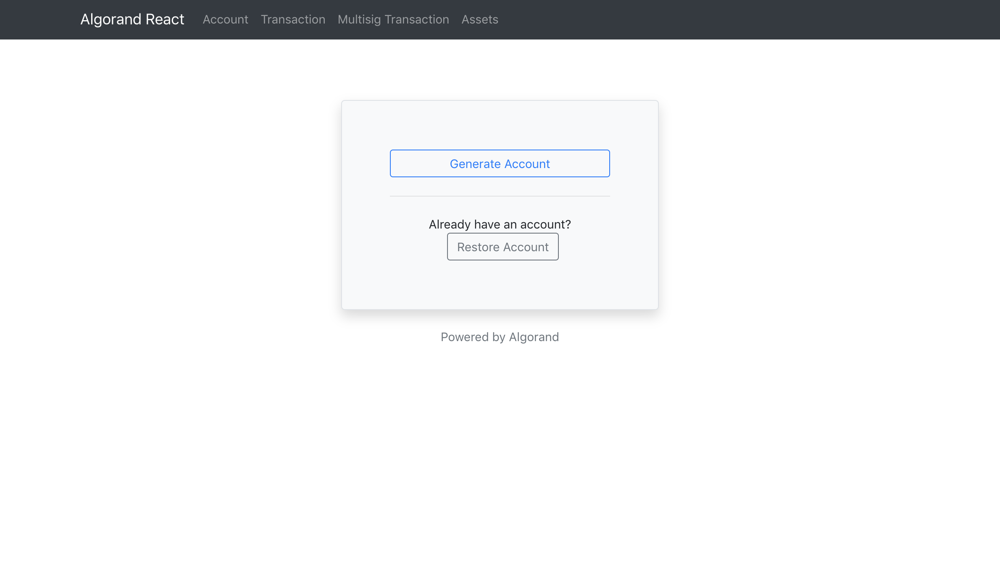
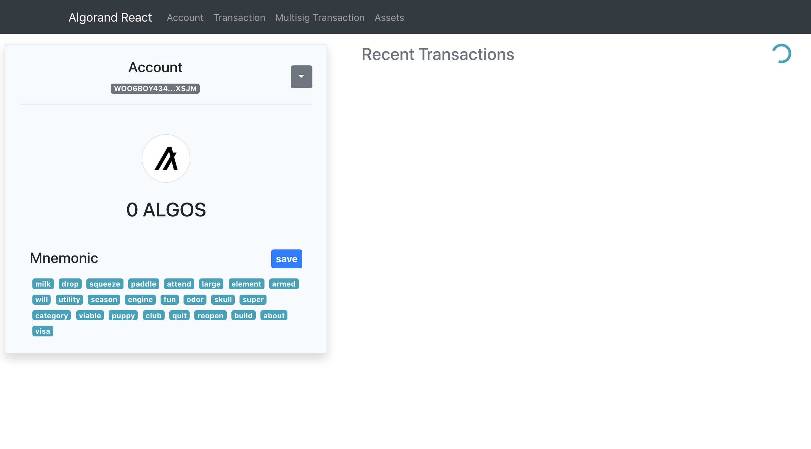
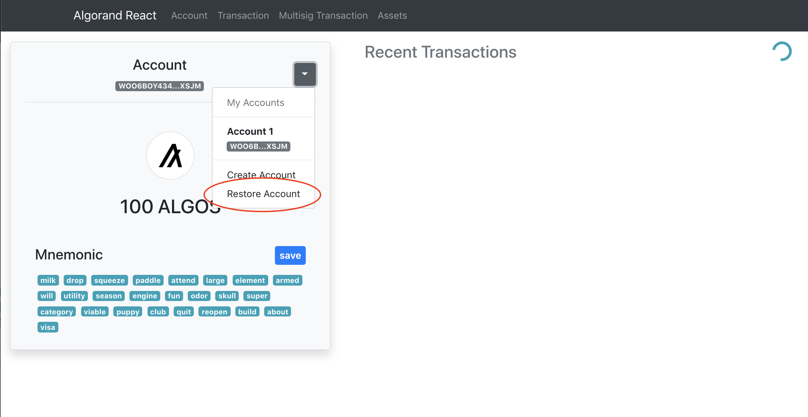
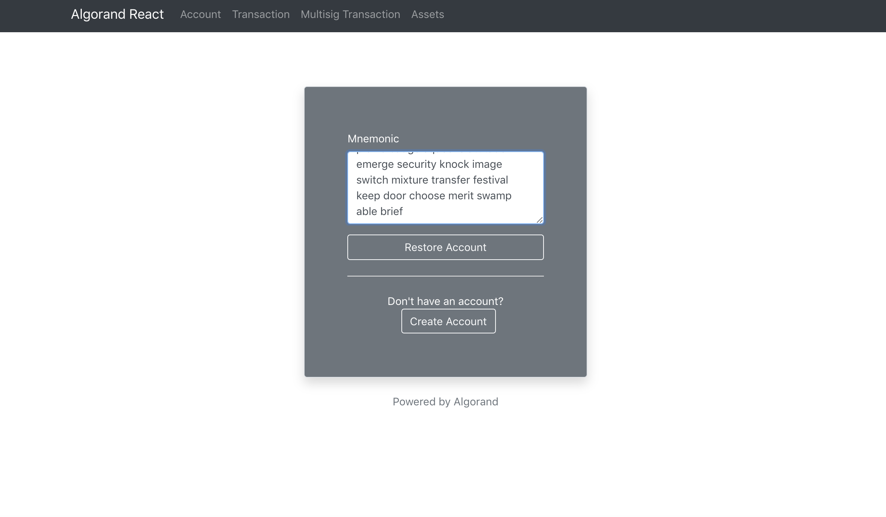
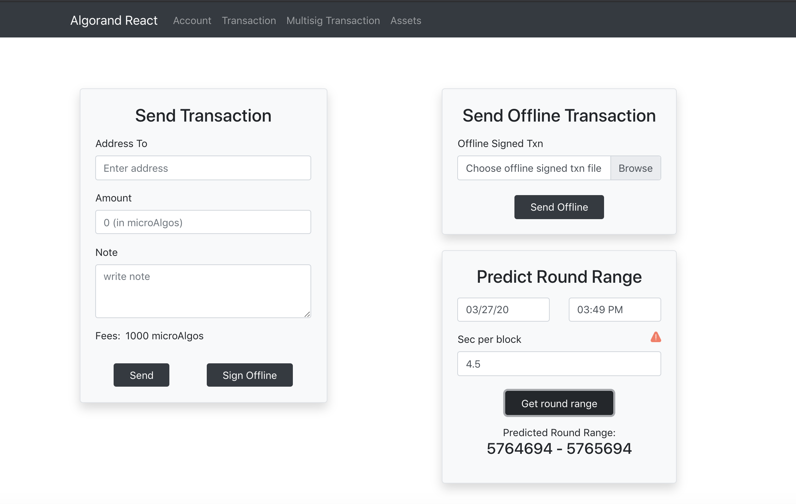
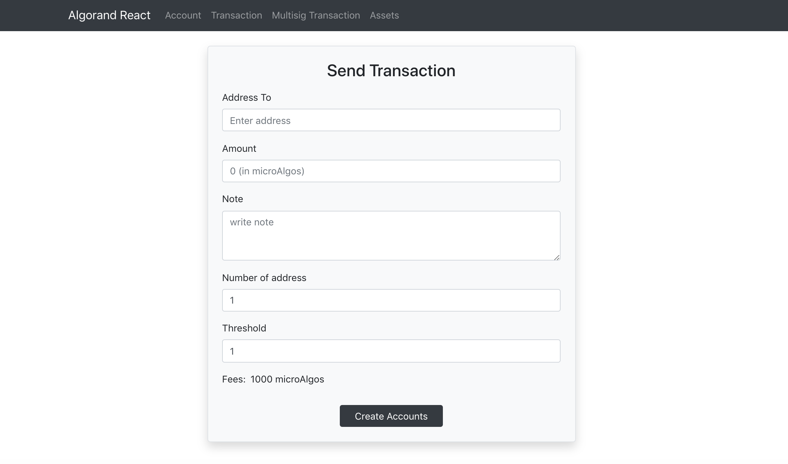
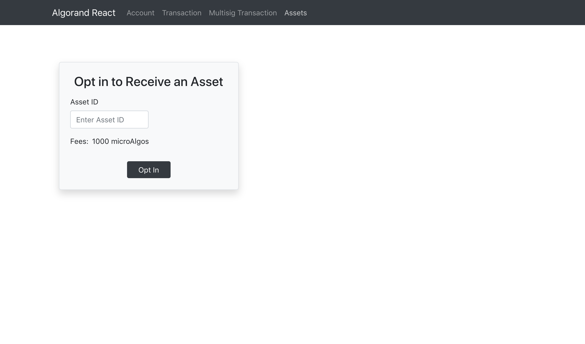
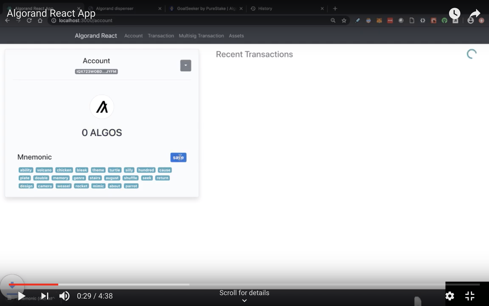

# Simple Algo: React App for Algorand Accounts and Transactions

## Overview
Simple Algo is a React application that makes use of several Algorand features. Including [account creation](https://developer.algorand.org/docs/features/transactions/#payment-transaction), [account recovery / importing](https://developer.algorand.org/docs/features/transactions/#payment-transaction), [pay transaction](https://developer.algorand.org/docs/features/transactions/#payment-transaction), [multi-sig transactions](https://developer.algorand.org/docs/features/transactions/#payment-transaction) and [ASA opt-in](https://developer.algorand.org/docs/features/asa/#revoking-an-asset) transactions.

## Motivation
React is the most popular front-end library for web development- the motivation to create this app was to lower the barrier to entry for web and full-stack developers to the Algorand blockchain.

## Requirements
- React v16.13.1
- React Router Dom v5.1.2
- Algosdk v1.5.0
- Bootstrap v4.4.1
- Jquery v3.4.1
- @popperjs/core v2.1.1
- clipboard-copy v3.1.0

## Get Started

```
git clone https://github.com/algorand/code-samples.git
cd react-app-acct-txn-msig-assetoptin
npm i
```

Make changes to the `token` `server` and `port` values in `src/services/algorandsdk.js` if you're [talking to Algorand](https://developer.algorand.org/docs/build-apps/setup/#how-do-i-obtain-an-algod-address-and-token) using something other than sandbox. 

```
npm run start
```

## Usage

- **Create an Account**

```javascript
const CreateAccountButton = props => {
  // this will create a new account and push it to props createAccount
  let generateAccount = () => {
    // generating new account
    let keys = algosdk.generateAccount();

    // calling the props createAccount
    props.createAccount(keys);
  };

  return (
    <button
      type="button"
      className="btn btn-outline-primary col-md-12"
      onClick={generateAccount}
    >
      Generate Account
    </button>
  );
};
```


  After creating your account, you should be directed to the `account` view.



The next to do, if using this app for the first time, is to fund the newly created account using the [testnet dispenser](https://bank.testnet.algorand.network/)

- **Recover / Import an Account**
  
```javascript
const RestoreAccountButton = props => {
  // this will create a new account and push it to props createAccount
  let restoreAccount = () => {
    // generating new account
    var keys = algosdk.mnemonicToSecretKey(props.mnemonic);

    // calling the props createAccount
    props.restoreAccount(keys);
  };

  return (
    <button
      type="button"
      className="btn btn-outline-light col-md-12"
      onClick={restoreAccount}
    >
      Restore Account
    </button>
  );
};
```


Enter an account mnemonic to recover.



Transactions can be signed and sent to the network, signed offline, or sent to the network from a offline signed transaction.



The multisig transaction page will create two accounts and a multisig address that needs to be funded.



The app also allows you to optin in to an asset

```javascript
// create opt-in transaction
      let opttxn = algosdk.makeAssetTransferTxn(recoveredAccount.addr, recoveredAccount.addr, undefined, undefined,
        params.fee, 0, params.lastRound, endRound, undefined, params.genesishashb64, params.genID, assetID);
```




## Community Development and Recommendations
This app is a great framework for getting started. It was designed and build out of a virtual hackathon with some additions and tweaks made a long the way. Currently, this app is missing an Asset Manager feature. By this I mean, it is missing a way to create assets, configure assets, transfer, delete and revoke assets. The app is also missing a page that can leverage Algorand's Atomic Transfer feature, specifically grouping, signing and sending transactions to the network. There also seems to be bug in `accountdetailcomponent.jsx` for rendering recent trasactions.
The port, server and token values are pointing to the [sandbox](https://github.com/algorand/sandbox) instance, you can configure how you would like to talk to the Algorand network in `src/services/algorandsdk.js`


## Video Demo
[](https://www.youtube.com/watch?v=8ijXyNpQ4Kc&feature=youtu.be)
